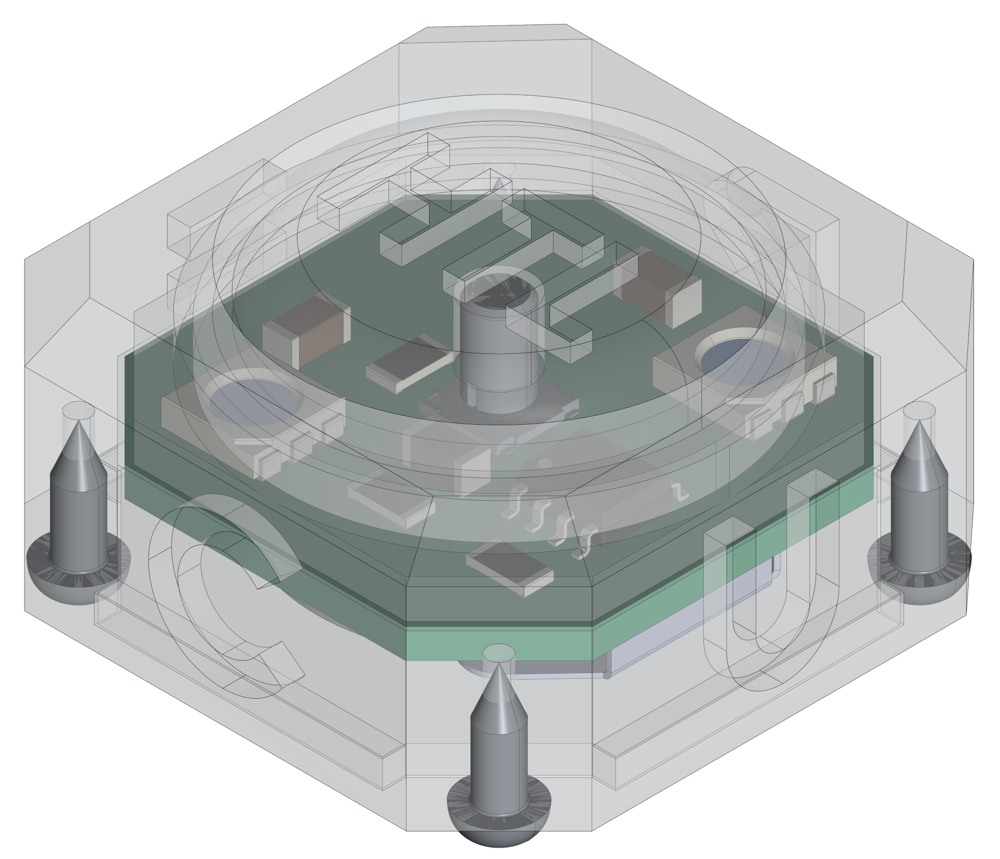
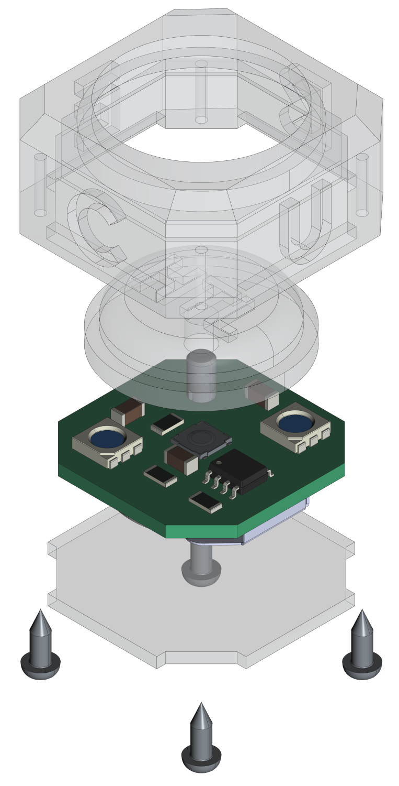

[](https://github.com/0x007e/rcc) [](https://creativecommons.org/licenses/by-nc-sa/4.0/legalcode) [](https://www.gnu.org/licenses/gpl-3.0.html) 

# `RCC` - RGB Color Cube

The `RCC` project is based on a pcb with an [ATtiny402](#additional-information) and two [RGB LEDs](#additional-information) that are controlled via SPI-bus. The cube itself is controlled over a single push-button that enables/disables the cube and can be used to setup the color and intensity of the rgb leds.

| Experience | Level |
|:------------|:-----:|
| Soldering   |  |
| Mechanical  |  |
| Software    |  |

# Downloads

| Type      | File               | Description              |
|:---------:|:------------------:|:-------------------------|
| Schematic | [pdf](https://github.com/0x007E/rcc/releases/latest/download/schematic.pdf) / [cadlab](https://cadlab.io/project/29642/main/files) | Schematic files |
| Board | [pdf](https://github.com/0x007E/rcc/releases/latest/download/pcb.pdf) / [cadlab](https://cadlab.io/project/29642/main/files) | Board file |
| Drill | [pdf](https://github.com/0x007E/rcc/releases/latest/download/drill.pdf) | Drill file |
| PCB | [zip](https://github.com/0x007E/rcc/releases/latest/download/kicad.zip) / [tar](https://github.com/0x007E/rcc/releases/latest/download/kicad.tar.gz) | KiCAD/Gerber/BoM/Drill files |
| Mechanical | [zip](https://github.com/0x007E/rcc/releases/latest/download/freecad.zip) / [tar](https://github.com/0x007E/rcc/releases/latest/download/freecad.tar.gz) | FreeCAD/Housing and PCB (STEP) files     |
| Firmware | [zip](https://github.com/0x007E/rcc/releases/latest/download/firmware.zip) / [tar](https://github.com/0x007E/rcc/releases/latest/download/firmware.tar.gz) | Firmware for ATtiny402 |

# Hardware

There are two parts of the hardware. The pcb and the housing of the `RCC`. The pcb is created with [KiCAD](#additional-information) and the housing with `FreeCAD`. The software is programmed with [Microchip (Atmel) Studio](#additional-information). All files are built with `github actions` so that they are ready for a production environment. The housing is printed with a 3D-printer (`Dremel 3D40`).

## PCB

The circuit board is populated on both sides (Top, Bottom). The best way for soldering the `SMD` components is within a vapor phase soldering system and for the `THT` components with a standard soldering system.

### Top Layer


### Bottom Layer


## Mechanical

The housing has a tolerance of `0.2mm` on each side of the case. So the pcb should fit perfectly in the housing. The tolerance can be modified with `FreeCAD` in the `Parameter` Spreadsheet.

### Assembled



#### Exploded



# Programming/Setup

The `RCC` is powerd with a `3V` battery (`CR2032`). It can be programmed over [UPDI](#additional-information) on `TP1`. The firmware for the cube can be downloaded in the [download section](#downloads).

``` bash
#                                                          +-----------+      +---------------------+
#                                                          |    U  +---+---+  |                     |
#     +---------------------+                              |    S  |  USB  |--+ +-----------------+ |
#     |                     |                              |    B  +---+---+  | | AVR-Dude        | |
#     |    RCC - Color Cube |         +----------+         |    /      |      | | ~~~~~~~~        | |
#     |                  +--+--+   +--+--+  U    |         |    U      |      | | ~~~~~           | |
#     |              VCC | TP3 +---+ VCC |  P  +--+--+  +--+--+ A      |      | | ~~~~~~~~~~~~    | |
#     |              GND | TP2 +---+ GND |  D  | GND +--+ GND | R      |      | |                 | |
#     |                  +--+--+   +--+--+  I  | VCC +--+ VCC | T      |      | +-----------------+ |
#     |                     |         |        +-----+  +-----+ A      |      |                     |
#     |                  +--+--+   +--+--+     | RxD +--+ RxD | +------+      | Computer            |
#     |             UPDI | TP1 +---+ PDI |     | TxD +--+ TxD | |5V/3V3|      |                     |
#     |                  +--+--+   +--+--+     +--+--+  +--+--+ +------+      +---------------------+
#     +---------------------+         | ADAPTER   |        +----+------+
#                                     +-----------+
```

## FUSES

| Register  | Value  |
|:---------:|:------:|
| `WDTCFG`  | `0x00` |
| `BODCFG`  | `0x00` |
| `OSCCFG`  | `0x03` |
| `TCD0CFG` | `0x00` |
| `SYSCFG0` | `0xF5` |
| `SYSCFG1` | `0x00` |
| `APPEND`  | `0x00` |
| `BOOTEND` | `0x00` |

# Software

The leds are controlled by `SPI`. The interface is displayed in the [dataflow](#dataflow-diagram) diagram. There is a pre-configured firmware to use the cube or a library to implement own solutions.

## Dataflow diagram


## Library (`led.h`)

With the attached `led` library it is quiet easy to use the cube for own implementations. To setup the led library for the cube implement the header file.

``` c
#define F_CPU 20000000UL

#include <avr/io.h>
#include <util/delay.h>

#include "./hal/avr0/system/system.h"
#include "./led/led.h"

LED_Data led1  = {
	0x01,
	0x0F,
	0x00,
	0x0A
};

LED_Data led2  = {
	0x01,
	0x00,
	0x0F,
	0x0A
};

int main(void)
{
    system_init();
    led_init();
    // ...

    while(1)
    {
        led_blink(LED_Position_Left | LED_Position_Right_Alternating, led_status_color(LED_Status_Ready, LED_MIN_INTENSITY), LED_Delay_MS_200, 2);

        LED_SOF();
        led_data(led1);
        led_data(led2);
        LED_EOF();

        _delay_ms(2000);
    }
}
```

# Additional Information

| Type       | Link               | Description              |
|:----------:|:------------------:|:-------------------------|
| ATtiny402  | [pdf](https://ww1.microchip.com/downloads/en/DeviceDoc/ATtiny202-402-AVR-MCU-with-Core-Independent-Peripherals_and-picoPower-40001969A.pdf) | ATtiny microcontroller |
| T3A33BRG   | [pdf](https://mm.digikey.com/Volume0/opasdata/d220001/medias/docus/6794/3147_T3A33BRG-H9C0002X1U1930.pdf) | RGB Color LED |
| Atmel ICE  | [pdf](https://ww1.microchip.com/downloads/en/DeviceDoc/Atmel-ICE_UserGuide.pdf) | Atmel ICE datasheet |
| UPDI       | [web](https://github.com/0x007e/updi) | UPDI-Adapter with AVR-Dude |
| Microchip Studio | [web](https://www.microchip.com/en-us/tools-resources/develop/microchip-studio) | Download page for Microchip Studio |
| KiCAD | [web](https://www.kicad.org/) | KiCAD project page |
| FreeCAD | [web](https://www.freecad.org/) | FreeCAD project page |

---

R. GAECHTER
